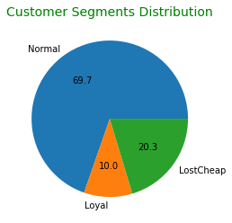
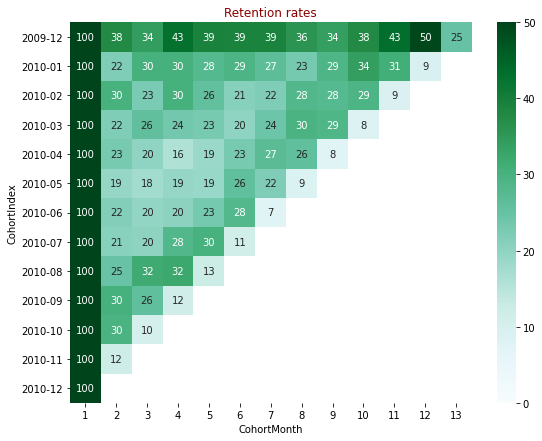

# RFM Analysis and Cohort Retention Rate Analysis

- Python script to perform RFM analysis to segment customers based on recency, frequency, monetary value.
- Python script for retention rate analysis.
- A case study from customer purchase history data of a company, which contains the following steps:

    1. Data preprocessing
    2. Exploration
    3. Study of target markets
    4. Customer evaluation (using rfm analysis)
    5. Customer retention analysis

### Dataset
A transactional dataset of a company within a period of time

### How to Use

###### For a simple and automated rfm analysis:


```python
from rfm.rfm import RFM
import pandas as pd

df = pd.read_excel('dataset.xlsx', parse_dates=[4])
rfm = RFM(df, customer_id='CustomerId', transaction_date='InvoiceDate', amount='amount', automated=True)

rfm.get_rfm_table()
```


<div>
<table border="1" class="dataframe">
  <thead>
    <tr style="text-align: right;">
      <th></th>
      <th>CustomerId</th>
      <th>RFM</th>
      <th>segment</th>
    </tr>
  </thead>
  <tbody>
    <tr>
      <th>0</th>
      <td>12346.0</td>
      <td>441</td>
      <td>LostCheap</td>
    </tr>
    <tr>
      <th>1</th>
      <td>12347.0</td>
      <td>111</td>
      <td>Normal</td>
    </tr>
    <tr>
      <th>2</th>
      <td>12348.0</td>
      <td>331</td>
      <td>Normal</td>
    </tr>
    <tr>
      <th>3</th>
      <td>12349.0</td>
      <td>221</td>
      <td>Normal</td>
    </tr>
    <tr>
      <th>4</th>
      <td>12351.0</td>
      <td>111</td>
      <td>Normal</td>
    </tr>
    <tr>
      <th>...</th>
      <td>...</td>
      <td>...</td>
      <td>...</td>
    </tr>
    <tr>
      <th>4307</th>
      <td>18283.0</td>
      <td>111</td>
      <td>Normal</td>
    </tr>
    <tr>
      <th>4308</th>
      <td>18284.0</td>
      <td>331</td>
      <td>Normal</td>
    </tr>
    <tr>
      <th>4309</th>
      <td>18285.0</td>
      <td>441</td>
      <td>LostCheap</td>
    </tr>
    <tr>
      <th>4310</th>
      <td>18286.0</td>
      <td>341</td>
      <td>Loyal</td>
    </tr>
    <tr>
      <th>4311</th>
      <td>18287.0</td>
      <td>111</td>
      <td>Normal</td>
    </tr>
  </tbody>
</table>
<p>4312 rows × 3 columns</p>
</div>


###### To plot segment distribution of customers:


```python
rfm.plot_segment_pie()
```


    

    


###### For a simple and automated retention analysis:


```python
from transaction.transaction import Transaction
transaction = Transaction(df, customer_id='CustomerId', transaction_date='InvoiceDate', automated=True)
```


    

    

